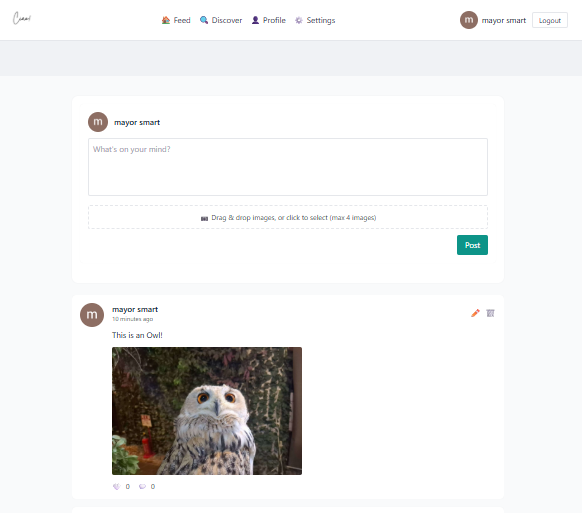

# Ciao Social App

[](https://github.com/user-attachments/assets/dca2e240-e178-47b5-845a-857751ac9550)

A simple social app (React frontend + Express backend) for posting articles, comments, and following users.

## Features

- Post and edit articles
- Comment on articles
- Follow users and view feeds
- Avatar upload and profile management

## Quick Start

1. Backend

```bash
cd backend
npm install
npm start
```

2. Frontend

```bash
cd frontend
npm install
npm start
```

## Project Structure

- backend/ - Express server, controllers, models, and routes
- frontend/ - React app (create-react-app)
- asset/thumbnail.png - Project thumbnail used above

## Video

Watch a quick demo: https://github.com/user-attachments/assets/dca2e240-e178-47b5-845a-857751ac9550

## Contributing

Open an issue or submit a PR.

## License

MIT
